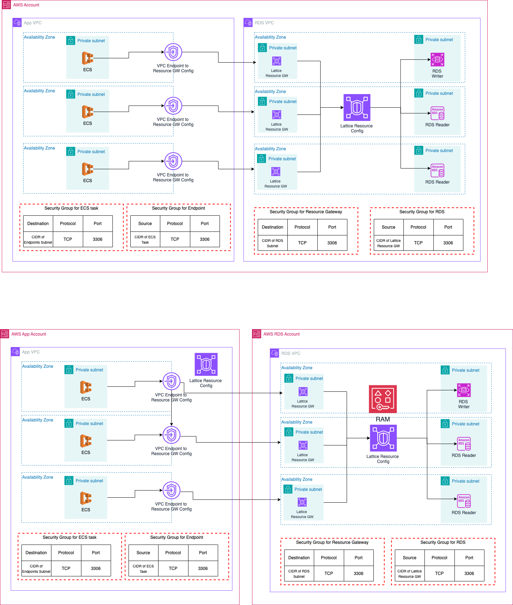

# This repo will demonstrate the features of AWS VPC Lattice and will provision the below infra components.

## Lattice Service with ECS, ALB and Lambda


## Resource Gateway with RDS 


## Below are the details of the Infra components
### 1. ECS Task:
* [hello-service](https://github.com/damvinod/hello-world) is a Java Spring boot service and will be deployed in VPC `hello-world-svc-vpc` which have below endpoints.
    * `/hello` -> Returns a static response of `Hello`
* [demo-service](https://github.com/damvinod/demo-service) is a Java Spring boot service and will be deployed in VPC `demo-svc-vpc`
  * `/hello` -> Connects to `/hello` endpoint of `hello-world` using [VPC lattice service endpoint](https://github.com/damvinod/vpc-lattice-demo/blob/main/demo-svc.tf#L43).
  * `/v1/hello` -> Connects to `/hello` endpoint of `hello-world` using service connect

### 2. ALB & Lambda:
* An ALB with Lambda as a target group will be provisioned
* Lambda will return a static response with `Hello World`

## Follow the below steps to try out the demo

### 1. Resource Gateway with RDS
#### Step 1: Enable `enable_vpc_lattice_rds_resource_gw_demo` in `variables.tf`
#### Step 2: Update the variable `bucket` name in `init.tf`
#### Step 3: Run below commands
```
aws s3api create-bucket --bucket <terraform_state_bucket_name> --region ap-southeast-1
terraform init
terraform plan
terraform apply
```
#### Step 4: Go to AWS Console -> VPC -> Endpoints -> Choose the endpoint with prefix `*-endpoint-to-rds-resource-gw` -> Click on Associations tab to get the details of endpoint.
#### Step 5: Use the below commands to get the `demo-service` task-id and `execute-command` into the container
```
aws ecs list-tasks --cluster merlion-dev-vpc-lattice-demo --service-name merlion-dev-demo-svc
aws ecs execute-command --cluster merlion-dev-vpc-lattice-demo --task <task_id_demo-service> --container demo_service --command "/bin/sh" --interactive
```
#### Step 6: Use the below command to test the connection from `demo_service` to the endpoints copied in `Step 4`. Should return SSL error.
```
# Should return SSL error.
curl -kv https://<endpoint_copied_from_step_4>:3306
```

### 2. Lattice Service with ECS, ALB and Lambda
#### Step 1: Enable `enable_vpc_lattice_service_demo` in `variables.tf`
#### Step 2: Update the variable `bucket` name in `init.tf`
#### Step 3: Run below commands
```
aws s3api create-bucket --bucket <terraform_state_bucket_name> --region ap-southeast-1
terraform init
terraform plan
terraform apply
```
#### Step 4: Use the below commands to get the `demo-service` task-id and `execute-command` into the container
```
aws ecs list-tasks --cluster merlion-dev-vpc-lattice-demo --service-name merlion-dev-demo-svc
aws ecs execute-command --cluster merlion-dev-vpc-lattice-demo --task <task_id_demo-service> --container demo_service --command "/bin/sh" --interactive
```
#### Step 5: Use the below command to test the communication between `demo_service` -> `hello_service`
```
# Should return SSL Hello.
curl http://localhost:8080/hello
```
#### Step 6: Get the value from the output variable `vpc_lattice_service_endpoint` and use it in the below commands.
```
# Should return SSL Hello World.
curl https://<vpc_lattice_service_endpoint>/alb
curl https://<vpc_lattice_service_endpoint>/lambda
```