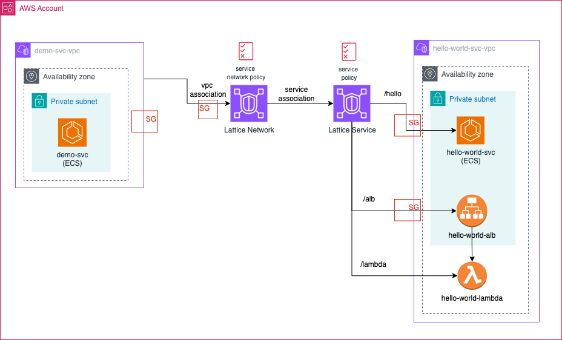

### This repo will demonstrate the features of AWS VPC Lattice and will provision the below infra components at high level.

#### 1. ECS Task:
Below two tasks will be created and these are simple Java Spring boot apps which has below endpoints
* `hello-service` in VPC `hello-world-svc-vpc`
    * `/hello` -> Returns a static response of `Hello`
* `demo-service` in VPC `demo-svc-vpc`
  * `/hello` -> Connects to `/hello` endpoint of `hello-world` using [VPC lattice service endpoint](https://github.com/damvinod/vpc-lattice-demo/blob/main/demo-svc.tf#L43).
  * `/v1/hello` -> Connects to `/hello` endpoint of `hello-world` using service connect

#### 2. ALB & Lambda:
* An ALB with Lambda as a target group will be provisioned
* Lambda will return a static response with `Hello World`

## Follow the below steps to provision the Infra

* ``aws s3api create-bucket --bucket terraform-test-bucket --region ap-southeast-1``
* ``terraform init``
* ``terraform plan``
* ``terraform apply``
* Get the ECS task id for `demo-service` and execute the below commands
  * `aws ecs execute-command --cluster merlion-dev-vpc-lattice-demo --task <task_id_demo-service> --container demo_service --command "/bin/sh" --interactive`
  * `curl http://localhost:8080/hello` -> Should be getting a response of `Hello`
* Get the VPC Lattice Service domain and execute the below commands to verify the connectivity with ALB & Lambda
    * `curl https://<vpc_lattice_service_domain>/alb` -> Should be getting a response of `Hello World`
    * `curl https://<vpc_lattice_service_domain>/lambda` -> Should be getting a response of `Hello World`.
